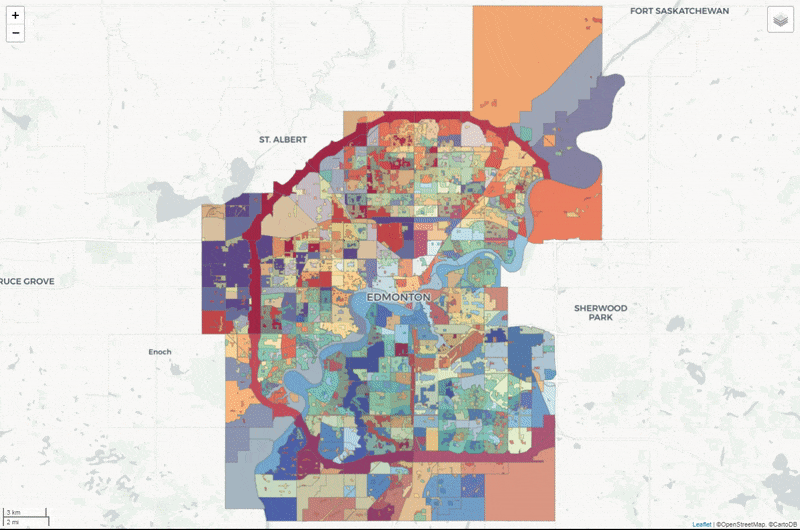
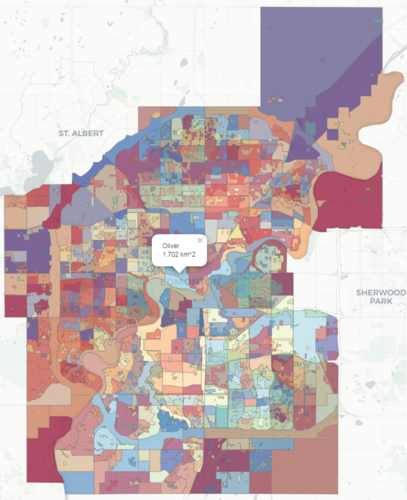

## Edmonton Municipality II
 

## Map
Purpose: View and explore Wards, Neighbourhoods, and, Zoning Bylaw of Edmonton

## To-do's
- [x] Minimize data with [topojson](https://github.com/topojson/topojson) eg. reducing coordinates accuracy and removing unwanted properties
- [x] Look into efficient ways to process [large file](https://stackoverflow.com/questions/4158102/loading-large-amount-of-data-into-memory-most-efficient-way-to-do-this) - [mapshaper](https://github.com/mbloch/mapshaper) and [topojson](https://github.com/topojson/topojson) 

[**CLICK ME FOR MAP!!**](https://edmonton-open-data.github.io/Edmonton-Municipality-II/)

